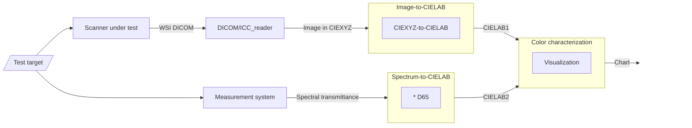

# Color characterization
# Requirements
  
## Input
  - scanned image from item I
  - reference from item II
## Output
  - color coordinates in the CIELAB space
  - specific RGB or HSI color ratios as target acceptance criteria
# Software Requirement Specification 
  - SRS 3100: Compare device output with reference in the CIELAB color space
  - SRS 3200: Convert device output image to CIELAB
  - SRS 3300: Convert reference spectrum to CIELAB
  - SRS 4100: Define a class for describing various color test target slides (e.g., Sierra)
  - SRS 2100: Define a class for exchanging spectra from different instruments/sources (e.g., Applied Image)
# System and Software Architecture Diagram

# Software Design Specification
  - SDS 3100: A function for implementing SRS 3100
  - SDS 3200: A function for implementing SRS 3200
  - SDS 3300: A function for implementing SRS 3300
  
# V&V
