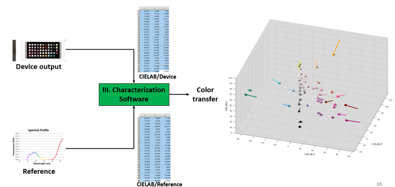
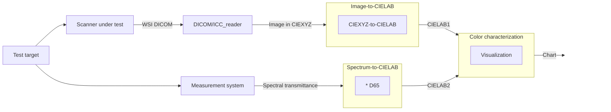

# Color characterization
# Requirements
  
## Input
  - scanned image from item I
  - reference from item III
## Output
  - color coordinates in the CIELAB space
  - specific RGB or HSI color ratios as target acceptance criteria
# Software Requirement Specification 
  - SRS 100: Compare device output with reference in the CIELAB color space
  - SRS 200: Convert device output image to CIELAB
  - SRS 300: Convert reference spectrum to CIELAB
# System and Software Architecture Diagram

# Software Design Specification
  - SDS 100: A class for implementing SRS 100
  - SDS 200: A class for implementing SRS 200
  - SDS 300: A class for implementing SRS 300
  
# V&V
