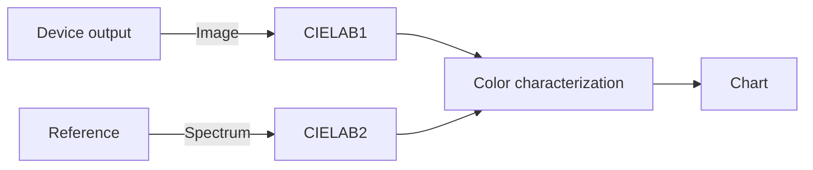

# Color characterization
# Requirements
  
## Input
  - scanned image from item I
  - reference from item III
## Output
  - color coordinates in the CIELAB space
  - specific RGB or HSI color ratios as target acceptance criteria
# Software Requirements Specification 
# System and Software Architecture Diagram
# Software Design Specification

# V&V
