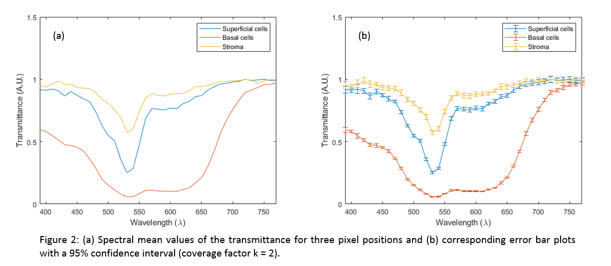

# A Spectral Database Collected with a Hyperspectral Imaging Microscopy System (HIMS)

This code was developed to read the hyperspectral transmittance data measured by DIDSR's Hyperspectral Imaging Microscope (HIMS) for a selection of 8 BiomaxOrgan10 tissue microarray slides (US Biomax, 15883 Crabbs Branch Way, MD 20855, USA):

| Tissue Name | Id | Serial | Position |
| :--- | :--- | :---: | :---: |
| [Bladder](https://github.com/DIDSR/HIMSPEC/tree/master/rgb_images/BiomaxOrgan10_Bladder_M13.png)| BL2082 | 066 | [M13](https://github.com/DIDSR/HIMSPEC/tree/master/tma_mapping_images/BladderTMAmap.png) |
| [Brain](https://github.com/DIDSR/HIMSPEC/tree/master/rgb_images/BiomaxOrgan10_Brain_H10.png) | CNS801 | 084 | [H10](https://github.com/DIDSR/HIMSPEC/tree/master/tma_mapping_images/BrainTMAmap.png) |
| [Breast](https://github.com/DIDSR/HIMSPEC/tree/master/rgb_images/BiomaxOrgan10_Breast_A1.png) | BR963c | A011 | [A1](https://github.com/DIDSR/HIMSPEC/tree/master/tma_mapping_images/BreastTMAmap.png) |
| [Colon](https://github.com/DIDSR/HIMSPEC/tree/master/rgb_images/BiomaxOrgan10_Colon_H6.png) | BC05002a | A022 | [H6](https://github.com/DIDSR/HIMSPEC/tree/master/tma_mapping_images/ColonTMAmap.png) |
| [Kidney](https://github.com/DIDSR/HIMSPEC/tree/master/rgb_images/BiomaxOrgan10_Kidney_H7.png) | BC07001 | C076 | [H7](https://github.com/DIDSR/HIMSPEC/tree/master/tma_mapping_images/KidneyTMAmap.png) |
| [Liver](https://github.com/DIDSR/HIMSPEC/tree/master/rgb_images/BiomaxOrgan10_Liver_H9.png) | BC03002 | G136 | [H9](https://github.com/DIDSR/HIMSPEC/tree/master/tma_mapping_images/LiverTMAmap.png) |
| [Lung](https://github.com/DIDSR/HIMSPEC/tree/master/rgb_images/BiomaxOrgan10_Lung_J7.png) | BC04002 | K166 | [J7](https://github.com/DIDSR/HIMSPEC/tree/master/tma_mapping_images/LungTMAmap.png) |
| [Uterine Cervix](https://github.com/DIDSR/HIMSPEC/tree/master/rgb_images/BiomaxOrgan10_UterineCervix_B10.png) | CR602 | 110 | [B10](https://github.com/DIDSR/HIMSPEC/tree/master/tma_mapping_images/UterineCervixTMAmap.png) |

The code outputs the CIE1931 XYZ and CIE1976 L\*a\*b\* coordinates and their covariance matrices. It also outputs the sRGB coordinates of the image.

## Contributors

The contributors to this project are: Paul Lemaillet (<paul.lemaillet@fda.hhs.gov>), Wei-Chung Cheng (<Wei-Chung.Cheng@fda.hhs.gov>), Jocelyn Liu (<jocelyn.cannot.fly@gmail.com>) and Samuel Lam (<sam1980lam@gmail.com>).

## Disclaimer

This software and documentation (the "Software") were developed at the Food and Drug Administration (FDA) by employees of the Federal Government in the course of their official duties. Pursuant to Title 17, Section 105 of the United States Code, this work is not subject to copyright protection and is in the public domain. Permission is hereby granted, free of charge, to any person obtaining a copy of the Software, to deal in the Software without restriction, including without limitation the rights to use, copy, modify, merge, publish, distribute, sublicense, or sell copies of the Software or derivatives, and to permit persons to whom the Software is furnished to do so. FDA assumes no responsibility whatsoever for use by other parties of the Software, its source code, documentation or compiled executables, and makes no guarantees, expressed or implied, about its quality, reliability, or any other characteristic. Further, use of this code in no way implies endorsement by the FDA or confers any advantage in regulatory decisions. Although this software can be redistributed and/or modified freely, we ask that any derivative works bear some notice that they are derived from it, and any modified versions bear some notice that they have been modified.

## Example
`ExampleCode.m` provides an example on how to read and display the input data and the computed outputs for the Uterine Cervix tissue sample. It creates an instance of the ReadSpectralData class that accepts as inputs the hyperspectral data measured by the HIMS (from 380 nm to 780 nm in steps on 10 nm):
- Mean value of the transmittance for each wavelength
- Standard deviation of the transmittance for each wavelength

The outputs for each pixel in the image are:
- The CIE 1931 tri-stimulus coordinates, CIEXYZ
- The covariance matrix on the CIEXYZ coordinates
- The CIEL\*a\*b\* 1976 coordinates
- The covariance matrix on the CIEL\*a\*b\* coordinates
- The sRGB coordinates

The input data are provided for each of the 8 selected tissues in the `input/\<Tissue Name\>/Transmittance` subfolder. For the example presented here: [input/UterineCervix_red/Transmittance](https://github.com/DIDSR/HIMSPEC/tree/master/input/UterineCervix_red/Transmittance)

The CIEXYZ coordinates of the reference white and the color coordinates (CIEXYZ, CIEYxy and CIEL\*a\*b\*) resulting from the transmittance measurements are displayed for a selection of pixels locations corresponding to superficial cells (X = 266; Y = 52), basal cells (X = 337; Y = 266) and stroma (X = 416; Y = 319). A tiff image is obtained by reshaping the sRGB coordinates:

  

For this selection of pixels positions, the spectral mean values of the transmittance are plotted. A line plot with error bars of the spectral transmittance is also presented (coverage factor *k = 2*, *i.e.* error bars = 2 standard deviations):

  

The color of these plots can follow the color order from Matlab or the sRGB color computed from the data. The CIEXYZ, CIEL\*a\*b\* and sRGB data can be visualized using a 3D scatter plot with the color of the data point following the sRGB coordinates:

  

The output CIE coordinates (CIEXYZ, CIEL\*a\*b\* and the respective covariance results) are saved in the [output/UterineCervix_red/CIE_Coord](https://github.com/DIDSR/HIMSPEC/tree/master/output/UterineCervix_red/CIE_Coord) subfolder. The sRGB color coordinates and tiff image are saved in the [output/UterineCervix_red/RGB](https://github.com/DIDSR/HIMSPEC/tree/master/output/UterineCervix_red/RGB) subfolder.

## US BiomaxOrgan10 dataset
For each tissue slide, the data is composed of 41 subfiles for the mean and 41 subfiles for the standard deviation of the transmittace data, i.e. one subfile for each measurement wavelength. These are stacked together to produce 2 datafiles, `transmittance_mean_camera.mat` and the `transmittance_std_camera.mat`, that can be read by the code presented in the `ExampleCode.m` file. For that purpose, line 35 of `ExampleCode.m`, the `sample_name` variable must point to the proper tissue data folder name:

| Tissue Name | Data Folder name |
| :--- | :--- |
| Bladder | BiomaxOrgan10_Bladder_M13 |
| Brain | BiomaxOrgan10_Brain_H10 |
| Breast | BiomaxOrgan10_Breast_A1 |
| Colon | BiomaxOrgan10_Colon_H6 |
| Kidney |  BiomaxOrgan10_Kidney_H7|
| Liver |  BiomaxOrgan10_Liver_H9 |
| Lung |  BiomaxOrgan10_Lung_J7 |
| Uterine Cervix |  BiomaxOrgan10_UterineCervix_B10 |

The size of the dataset is 2.3Gb. You can prevent updating it when submitting a `pull` request by first typing under the `HIMSPEC_Test` folder:

`git rm --cached input/\*`

This action can be canceled by typing:

`git add .`

and the data can be pulled by typing:

`git pull origin master`

